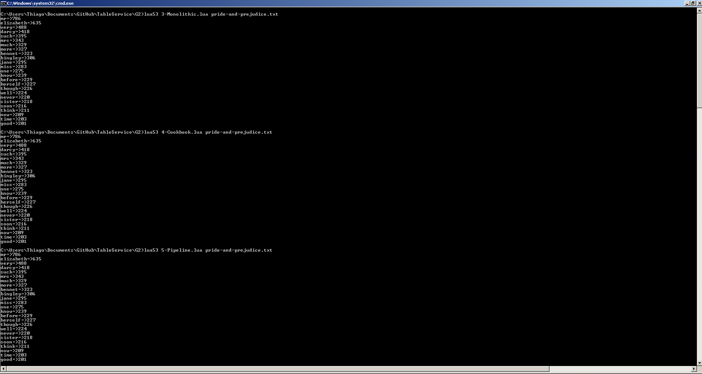

Dupla: Thiago Lages de Alencar e Miguel José Gonçalves da Silva    
Matricula: 1121561 e 1111284

# Princípios de Engenharia de Software #
Objetivo do trabalho é pegar 4 estilos do livro "Exercises in Programming Style" e reescrever em Lua. Tem que usar as [6 regras da disciplina](https://pes2006.wordpress.com/2006/03/15/disciplina/ ).

# Exemplo de como usar #
* Faça o download do repositório, depois no prompt de comando caminhe até a pasta onde contém os arquivos.lua
* Digite no prompt de comando
```
lua 3-Monolithic.lua input.txt
```
ou
```
lua 4-Cookbook.lua input.txt
```
ou
```
lua 5-Pipeline.lua input.txt
```
ou
```
lua 7-Infinite_Mirror.lua input.txt
```



# Resultado para o texto pride-and-prejudice.txt #
```
mr=>786
elizabeth=>635
very=>488
darcy=>418
such=>395
mrs=>343
much=>329
more=>327
bennet=>323
bingley=>306
jane=>295
miss=>283
one=>275
know=>239
before=>229
herself=>227
though=>226
well=>224
never=>220
sister=>218
soon=>216
think=>211
now=>209
time=>203
good=>201
```

# Timeline das atividades #

* 25/04 - Criação do Github para a preparação do trabalho

* 25/04 - Leitura do Livro

* 26/04 - Reunião da escolha dos estilos.

* 02/05 - Desenvolvimento do primeiro estilo: Monotithic
* 02/05 - Adequação do código acima usando as regras vistas em sala de aula

* 03/05 - Desenvolvimento do segundo estilo: Cookbook
* 03/05 - Adequação do código acima usando as regras vistas em sala de aula

* 03/05 - Desenvolvimento do terceiro estilo: Pipeline
* 03/05 - Adequação do código acima usando as regras vistas em sala de aula

* 03/05 - Desenvolvimento do quarto estilo: Infinite Mirror
* 03/05 - Adequação do código acima usando as regras vistas em sala de aula

* 03/05 - Revisão conjunta geral do código

# Diário de Desenvolvimento #
02/05
- No início se teve uma dificuldade para transformar python em lua, mas no decorrer do desenvolvimento os obstáculos foram superados.
- Foi necessário ler alguns textos, para se fazer a leitura de arquivo em lua
- Tinha algumas coisas de expressão regular que foi necessário ser relembrado para o entendimento do código.
- Outra coisa que pesquisamos, foi pegar pedaços de uma string e percorrer um array.
- Um incomodo que sentimos foi a contagem do array começar em 1 ao invés de 0. Isso foi resolvido colocando o contador iniciando em 1.
- Nós testamos o código com um texto pequeno e um gigante, no pequeno não teve problemas, mas no grande a letra "s" foi considerada uma palavra por contas de frases como "elisabeth's house". Creio que o ' separe as palavras e assim esteja causando esse erro.

03/05
- Foi identificado no código da autora, que ela adicionou no filtro, palavras de uma letra só. Pois não são palavras, por isso que a letra s não aparece no contador de palavras dela. Fizemos uma alteração no código e o problema foi resolvido.
- Discutimos uma mudança do nome de variáveis para um melhor entendimento do código (uma das regras vistas em aula).

04/05
- Resolvido problema de stack overflow no estilo Infinite Mirror